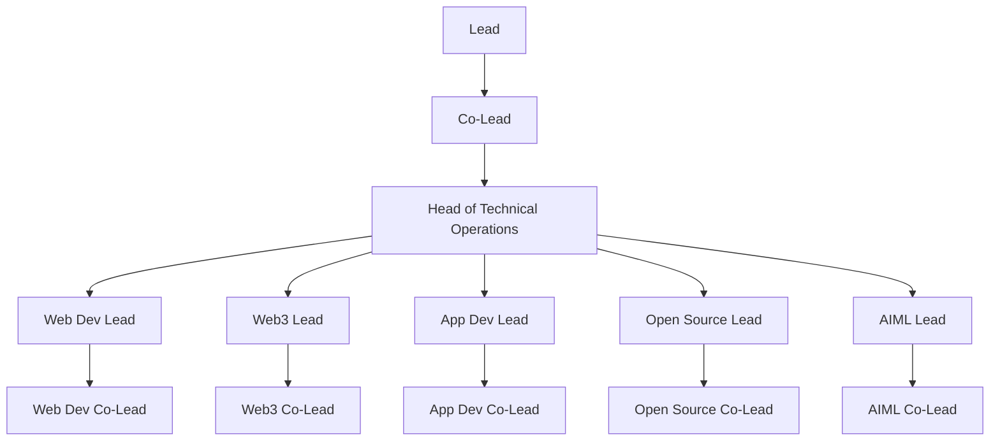

<!-- GitHub Banner -->

---

  
  
  
  
  
  

---

## 👋 About Us

**ELEVATE** is the official **Development Club of IIIT Nagpur**, where we believe in  
💡 *learning by building together*.  
We explore **Web Dev, App Dev, AIML, Web3, and Open Source**,  
organize workshops, hackathons, and contribute to real-world projects.  

> Our motto: **CODE. INNOVATE. ELEVATE.**

---

## 🏗️ Tech Team Hierarchy  

---

## 🌐 Connect With Us  

 
   
   
   
   

---

## 🛠️ Tech Domains We Explore  

 
   

---

## ✨ Highlights  

- 🚀 Workshops & Hackathons  
- 🛠️ Open Source Contributions  
- 🌍 Collaborative Projects  
- 💡 Tech Talks & Knowledge Sharing  
